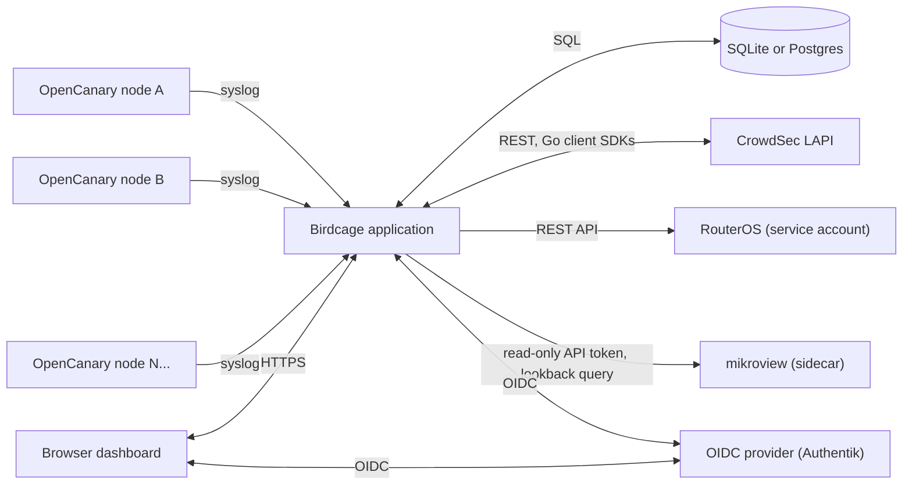

# Birdcage architecture

## System context

Each OpenCanary instance pushes its own hits via syslog (its native
`SyslogLogger` output) -- birdcage never polls, since OpenCanary has no
query API. See [issue #1](https://gitlab.tomlawson.io/ai/birdcage/-/issues/1)
for how nodes get configured to point at their birdcage instance at
install time.

## Application boundaries

| Boundary | Responsibility | Status |
| --- | --- | --- |
| Ingestion bridge | Parse OpenCanary syslog output, normalize into `alerts` | Not yet implemented -- [#2](https://gitlab.tomlawson.io/ai/birdcage/-/issues/2) |
| Storage | Persist alerts and the audit log (SQLite and Postgres, both mandatory in v1, selected by `DATABASE_URL`) | Landed with #2/#7; see [ADR-0001](adr/0001-stack-and-storage.md) and [docs/configuration.md](configuration.md) |
| Dashboard | Multi-instance alert view, filtering, canary registry/heartbeats, visitors grouped by source and the trace | API landed (#3, #34, #35); UI pending |
| Analysis | Turn raw alert volume into an actionable signal | Not yet defined -- [#6](https://gitlab.tomlawson.io/ai/birdcage/-/issues/6) |
| CrowdSec integration | Query/act on CrowdSec decisions via official Go SDKs | Not yet implemented -- [#4](https://gitlab.tomlawson.io/ai/birdcage/-/issues/4) |
| RouterOS mitigation | Apply firewall/address-list changes via a service account | Not yet implemented -- [#5](https://gitlab.tomlawson.io/ai/birdcage/-/issues/5) |
| Audit log | Append-only record of every automated action taken | Required for v1; write path lands alongside #4/#5 |
| Auth | Local accounts, OIDC, sessions, API/ingest tokens -- copied model from mikroview | Not yet implemented -- [#8](https://gitlab.tomlawson.io/ai/birdcage/-/issues/8); see [ADR-0003](adr/0003-mikroview-sidecar.md) |

## Data model

Tables designed alongside the issue that needed them, rather than fixed in
advance:

- **`alerts`**: `instance_id`, `source_ip`, `dest_port`, `service`, `raw`,
  `received_at`. One row per OpenCanary hit (#2).
- **`audit_log`**: `action`, `target`, `reason`, `triggered_by`,
  `created_at`. One row per automated action birdcage takes. Append-only by
  convention and by a database trigger -- the application layer must never
  issue `UPDATE`/`DELETE` against it.
- **`canaries`**: the registry of enrolled OpenCanary instances (#34) --
  `id` (the same value `alerts.instance_id` carries), `name`, `lane`,
  `ports`, `heartbeat_interval_s`, `enrolled_at`, `last_heartbeat_at`.
- **`heartbeats`**: `canary_id`, `at`. One row per phone-home
  (`POST /api/heartbeat`), pruned to the last 24h on insert (#34).

Accounts, sessions and tokens follow mikroview's shapes (ADR-0003); their
storage is designed with #8.

## Deployment and branching

See [ADR-0002](adr/0002-gitflow-branching.md) for the `dev` -> `preview` ->
`main` branch/promotion model, and mikroview's `Dockerfile`
(`tomlawesome/mikroview`) for the distroless multi-stage container pattern
birdcage's own `Dockerfile` is expected to follow once implementation
starts. Birdcage is deployed in the same compose stack as mikroview --
see [ADR-0003](adr/0003-mikroview-sidecar.md).
